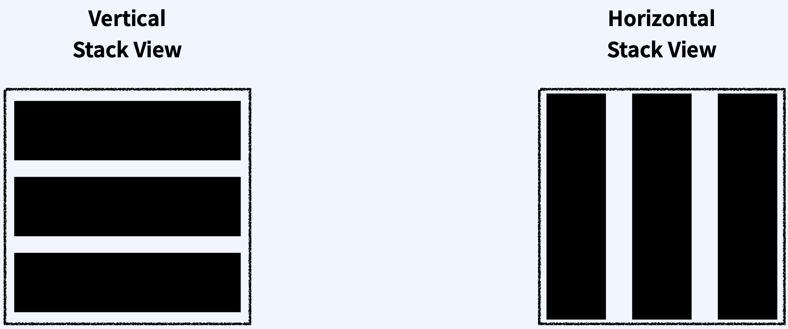
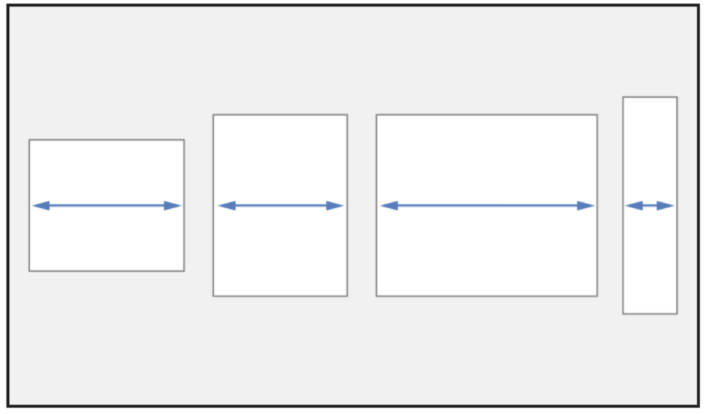
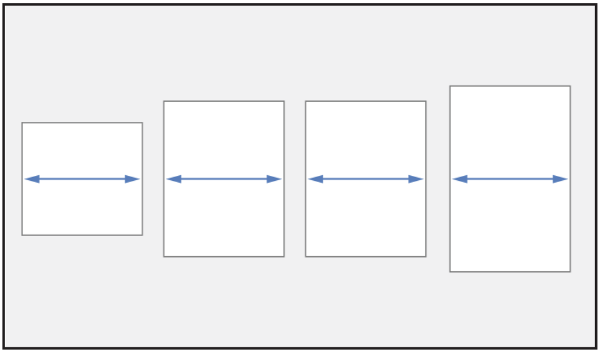
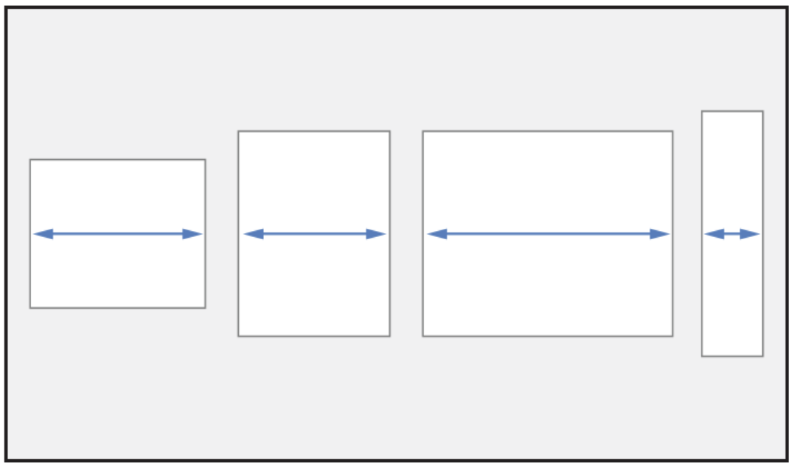
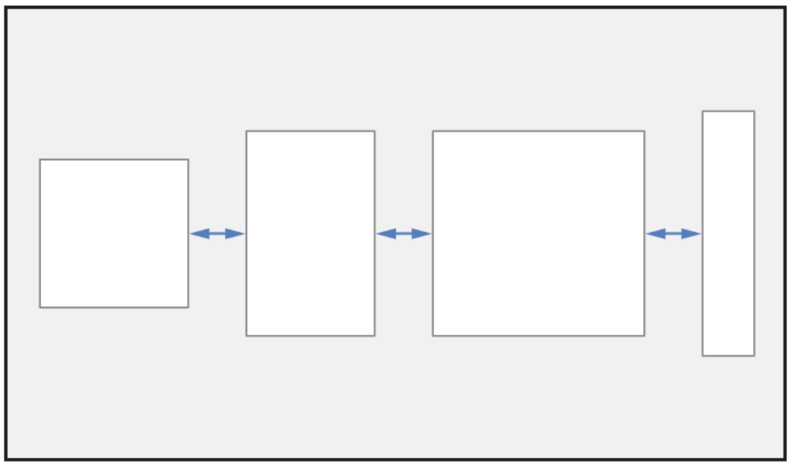
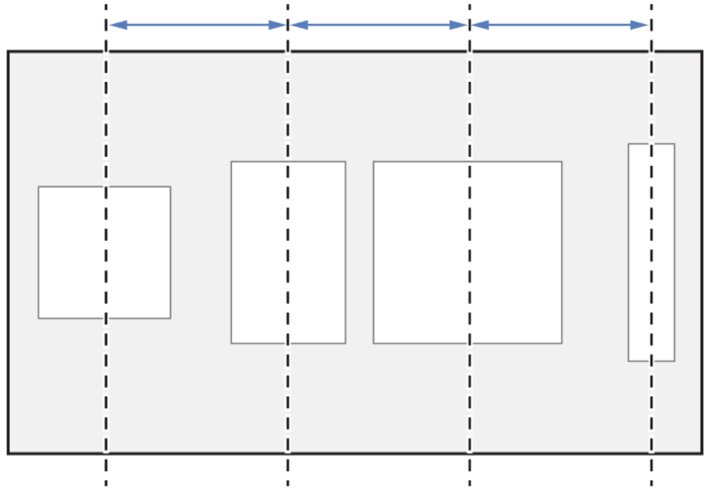

# UIStackView
* 정의: 열 또는 행에 View들의 묶을을 배치할 수 있는 간소화된 인터페이스
* 장점: AutoLayout 제약 조건을 많이 사용하지 않아도 쉽게 UI구성이 가능하다.
* 속성:
  * `UIStackView Axis`: Stack View의 방향을 결정
    * Vertical Stack View: Sub View 들이 세로 방향으로 추가된다.
    * Horizontal Stack View: Sub View 들이 가로 방향으로 추가된다.
       
  * ## `UIStackView Distribution`: Stack View 안에 들어가는 Sub View들의 Size를 어떻게 분배할지 설정
    * `Fill` Option: Stack View의 방향에 따라 가능한 공간을 모두 체우기 위해서 Sub View들의 사이즈를 재조정
       
      * Sub View 들의 크기가 Stavk View의 크기를 `초과`하면 각 Sub View의 `크기를 감소`시킨다. 
      * Sub View 들의 크기가 Stack View의 크기에 `미달`하면 각 Sub View의 `크기를 늘려서 Stack View를 채운다`. 
    * `Fill Equally` Option
       
    * `Fill Proportionally` Option: Stack View의 방향에 따라 Sub View가 갖고있던 크기에 비례하여 공간을 차지한다.
       
    * `Equal Spacing` Option: Stack View의 방향에 따라서 Sub View들 사이의 공간은 균등하게 배치
       
    * `Equal Contering` Option: Stack View의 방향에 따라서 각 Sub View들의 Center와 Center 간의 길이를 동일하게 맞춤
         

  * ## `UIStackView Alignment`: Stack View의 Sub View들을 어떤 식으로 정렬할지 결정하는 순서
    * `Fill` Option: Stack View의 방향에 따라 Sub View들을 꽉 채워 늘린다.
    * `Leading` Option: Vertical Stack View에서 Sub View들을 꽉 채워 늘린다.
    * `Top` Option: Horizontal Stack View에서 Sub View들을 위쪽으로 정렬
    * `First Baseline` Option: Sub View들의 First baseline에 맞춰 정렬(Horiaontal Stack View 에서만 사용 가능하다.)
    * `Center` Option: Stack View의 방향에 맞춰 Sub View들의 Center를 StackView의 Center에 맞춰 정렬 
    * `Trailing` Option: Vertical Stack View에서 Sub View들을 오른쪽 정렬
    * `Bottom` Option: Horizontal Stack View에서 Sub View들을 Stack View의 아래 쪽에 맞춰 정렬 
      