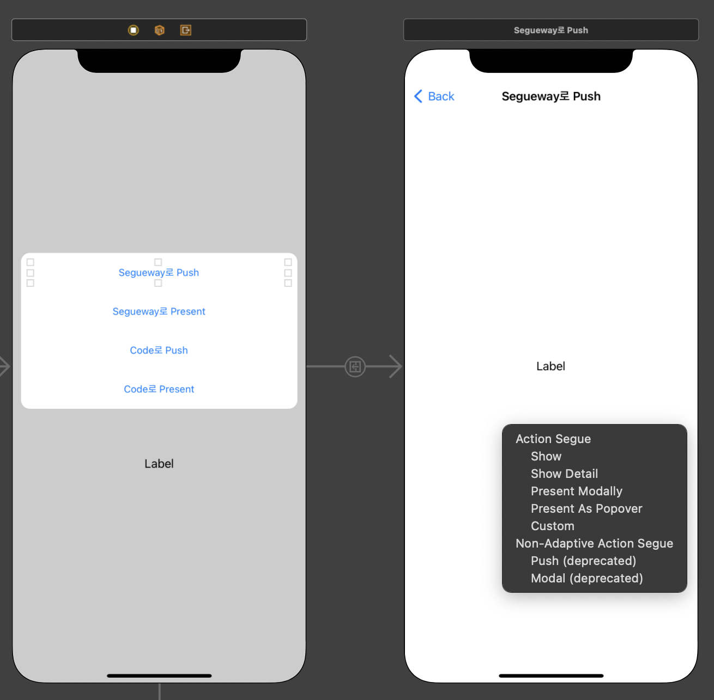

# iOS 화면 전환 방법
1. 소스코드를 통해 전환하는 방식
2. Storyboard를 통해 전환하는 방식
3. ViewController에서 다음 ViewController를 호출하여 전환하는 방식(Presentation 방식)
   > 기존 ViewController위에 새로운 ViewController의 화면을 덮는 방식  
4. ViewController의 View 위에 다른 View를 가져와서 바꿔치우는 방식
   > 메모리 누수 위헙이 있으므로 사용하지 않는것을 권장.   
5. Navigation Controller를 사용하여 전환하는 방식

## 소스코드를 통해 전환하는 방식
* `self.storyboard?.instantiateViewConroller`: Storyboard에 존재하는 ViewController를 인스턴스화
 
   ```Swift
   @IBAction func tapCodePuchButton(_ sender: UIButton) {
       guard let viewController = self.storyboard?.instantiateViewController(identifier: "CodePushViewController") else { return }
   } 
   ```
   > Storyboard에서 ViewController의 Identity Storyboard Id를 지정하고 해당 식별자를 identifier Parameter에 넘겨준다.   
   반환 타입이 Optional 이므로 guard문으로 Optional binding   

## Storboard를 통해 전환하는 방식
* Storyboard에서 Drag And Drop 을 통해 Action Segue 선택
 
    
    