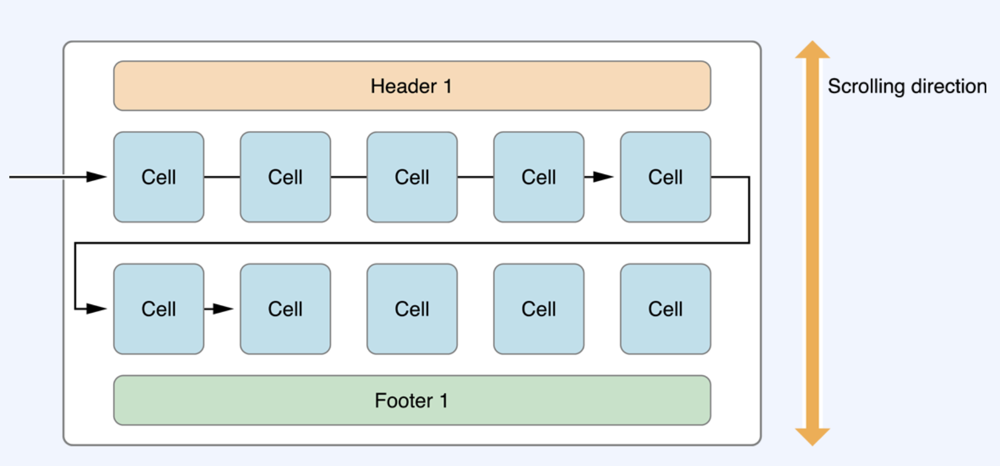

# 일기장 앱

## 기능 상세
* 일기장 탭을 누르면 일기 리스트를 표시할 수 있다.
* 즐겨찾기 탭을 누르면 즐겨찾기한 일기 리스트를 표시할 수 있다.
* 일기를 등록, 수적, 삭제, 즐겨찾기 할 수 있다.

<br>

## 활용 기술
* `UITabBarController`
* `UICollectionView`
* `NotificationCenter`

<br>

## UITabBar
* 앱에서 서로 다른 하위작업, 뷰, 모드 사이의 선택을 할 수 있도록, 탭바에 하나 혹은 하나 이상의 버튼을 보여주는 컨트롤러
 
    
    > 일반적으로 TabBar는 UITabBarController와 함께 사용하지만 App에서 독립적인 컨트롤로 사용할 수 있다.

<br>

## UITabBarController
* 다중 선택 인터페이스를 관리하는 컨테이너 뷰 컨트롤러로, 선택에 따라 어떤 자식 뷰 컨트롤러로 보여줄 것인지가 결정
 
     

  * TabBarController 인터페이스에 있는 각 Tab은 CustomViewController에 연관되어 있으며, 사용자가 특정 Tab을 선택하면 TabBarController는 그에 상응하는 ViewController의 Root View를 표시한다. 
  * TabBarController는 UIViewController를 상속받는 Class 이므로, View 속성을 갖는다.
  * 해당 View는 TabBarView와 Custom Content를 포함한 View이다.
  * TabBarView는 사용자를위해 선택 컨트롤러를 제공하며, 하나 혹은 하나 이상의 Tab Bar Item으로 구성된다.

<br>

## UICollectionView
* 데이터 항목의 정렬된 컨렉션을 관리하고 커스텀한 레이아웃을 사용해 표시하는 객체
* TableView 처럼 CrollView를 상속받고 있으며, 다양한 Layout을 보여줄 떄 주로 사용한다.
 
    
    > TableView는 List 형태로만 표현이 가능하지만, CollectionView는 List 형태로도 표현이 가능하고 위의 이미지처럼 다양한 형태로 표현이 가능하다.

* CollectionView의 구성
  
     
    * `Supplementary View`: 세션에 대한 정보를 표시
      * Header, Footer
      * 필수로 구현할 필요는 없다.
    * `Cell`: CollectionView의 주요 콘텐츠를 표시
      * CollectionView는 CollectionView Data Source 객체에서 표시할 Cell의 정보를 가져온다.
    * `Decoration View`: CollectionView에 대한 배경을 꾸밀 때 사용
      * Layout객체는 Decoration View를 사용하여 Custom한 배경을 구현할 수 있다.

<br>

## CollectionView Layouts
* CollectionView는 Layout 객체를 통해 CollectionView 내에 Item 배치 및 시각적 스타일을 결정한다.
* Layout객체가 하는 일은 Cell, Supplementary View, CollectionView의 bound, 내부에 있는 Decoration View의 위치를 결정하고 시각자 상태의 정보를 CollectionView에 제공한다. 
* UICollectionView에서는 UICollectionViewFlowLayout을 사용해서 항목들을 정렬할 수 있으며, 해당 클래스를 사용하게 되면 Cell을 원하는 형태로 정렬할 수 있다.
* FlowLayout은 Cell의 선형 경로를 배치하며, 최대한 Row를 따라 많은 Cell을 채우다가 현재의 Row에 더이상의 Cell이 들어갈 수 없게 된다면 새로울 Row를 만들어 계속해서 배치해나간다.
  
    
* UICollectionViewLayout
* UICollectionViewFlowLayout

<br>

## UICollectionViewFlowLayout
* 구성 단계
  1. Flow Layout 객체를 작성하고 컬렉션 뷰에 이를 할당한다.
  2. Cell의 width, heigth를 정한다.(반드시 지정! 만약 지정하지 않을 경우 값이 0이 되어 표시되지 않느다.)
  3. 필요한 경우 Cell들 간의 좌우 최소 간격, 위아래 최소 간격을 설정한다.
  4. 섹션에 header와 footer 가 있으면 이것들의 크기를 지정한다.
  5. layout의 스크롤 방향을 설정한다. 
* FlowLayout은 Cell과 Row사이에 간격을 설정할 수 있다.
  * 여기서 설정하는 간격을 최소 간격으로 배치하는 방법에 따라 지정한 값보다 큰 값으로 설정될 수 있다.
  * Cell들의 크기가 같으면 최소로 설정한 간격을 지킬 수 있지만, Cell들의 크기가 다르면 실제 간격이 다를 수 있다.

    

    

<br>

## UICollectionViewDataSource
* 컬렉션 뷰로 보여지는 콘텐츠들을 관리하는 객체
* DataSource를 정의하기 위해서는 UICeollvetionViewDataSource protocol을 준수해야 한다.
* DataSource의 역학은 CollectionView에 몇개의 섹션이 있는지 특정 섹션에 몇개의 Cell이 존재하는지 특정 섹션이나 셀의 컨텐츠를 보여주기 위해 어떤 View를 사용할 것인가에 대한 정보를 CollectionView에 제공하는것이다.
* UICollectionViewDataSource protocol의 주요 Method

    
    > optional 키워드가 없는 메서드들은 필수 메서드

<br>

## UICollectionViewDelegate
* 콘텐츠의 표현, 사용자와의 상효작용과 관련된 것들을 관리하는 객체

<br>

## CollectionView 와 관련된 핵심 객체들의 관계
* CollectionView는 DataSource에서 보여줄 Cell에 대한 정보를 가져온다.
* Layout 객체에서 해당 Cell에 속하는 위치를 결정한다.
* 하나 이상의 Layout 속성 객체로 CollectionView에 전송한다.
* CollectionView는 Layout의 정보를 실제 Cell이나 다른 View들과 결합하여 최종적으로 사용자에게 보여준다.


<br>

## 기본 UI그리기
* Storyboard 에서 Tab Bar Controller 추가
  * Tab Bar Controller의 Is Initial View Controller 속성 선택
    * Storyboard의 시작점이 Tab Bar Controller로 지정된다.
  * 기본적으로 Relation된 컨트롤러 삭제
* Navigation Controller 추가
  * Default Root Controller 삭제
  * ViewController를 Navigation Controller의 Root View Controller로 지정
* Tab Bar Controller의 Relationship Seguway(view controllers)를 Navigation Controller로 지정
  * 하단에 Item Tab이 생성된 것을 확인할 수 있다.
  * Item Tab을 누르면 Navigation Controller의 Root View Controller가 표시된다.
* 어떤 화면인지 구분할 수 있도록 임시 Label 추가(titld: 일기장 화면)
* Navigation Controller의 Tab Bar의 속성 설정
  * Selected Image: folder.fill
  * Title: 일기장 
  * Image: folder
* Navigation Controller 추가
  * * Default Root Controller 삭제
* View Controller 추가
  * ViewController를 Navigation Controller의 Root View Controller로 지정
* Tab Bar Controller의 Relationship Seguway(view controllers)를 Navigation Controller로 지정
  * 하단에 Item Tab이 하나 더 추가된 것을 확인할 수 있다.
* 추가된 Navigation Controller의 Tap Bar 속성 설정 
  * Selected Image: star.fill
  * Title: 즐겨찾기 
  * Image: star
* 즐겨찾기 Controller에 임시 Label 추가(titld: 즐겨찾기)
* 일기장 ViewController에 CollectionView 추가
  * top:0, leading: 0, trailing: 0, bottom: 0 설정
  * Collection View 에 Custom Cell 구성
    * Cell이 Row마다 2개씩 표시되도록 설정 -> 속성 -> Identifier: DiaryCell 설정
    * width 180, height: 200
  * Cell에 일기 제목과 날자를 표시할 Label 2개 추가
    * 제목 Label의 Alignment: center
    * 제목 Label의 Lines: 0  //Label의 text를 여러 줄 기입할 수 있다.
    * 날짜 Label의 leading: 12, bottom: 12, trailing: 12 설정
    * 날짜 Label의 Alignment: center
    * 날짜 Label의 font Semibold
    * 제목 Label의 Top: 12, leading: 12, Trailing: 12, Bottom: 12
      * hugging prioriry error 발생
      * 제목 Label이 늘어야야 하므로 hugging prioriy를 날짜 Label보다 작게 설정 -> 250으로 설정
    * 제목 Label이 늘어나도 날짜 Label이 사라지지 않도록 설정
      * content compression Resistence Priority값을 제목 Label보다 높게 설정 -> 751
* 생성한 Custom Cell을 Class와 연결
  * class: DiaryCell
  * Subclass of: UICollectionViewCell
* StarViewController Class와 연결
  * class: StarViewController
  * Subclass of: UIViewController
* Collection View 추가
  * top: 0, leading: 0, trailing: 0, bottom: 0
* Custom Cell
  * width: 드래그로 Collection View에 꽉 차게
  * height: 80
  * Label 2개 추가
    * Stack View 설정
    * leading: 24, trailing: 24
    * vertical in container check
    * spacing: 12
    * 날짜 Label semibold
  * CustomCell class와 연결
    * class: StarCell
    * Subclass of: UICollectionViewCell

<br>

## 일기 작성 화면 구성
* 일기장 ViewController의 Navigation Bar 에 Bar Button Item 추가(Systme Itme: Add)
* View Controller 추가
  * 일기장 ViewControler에서 Bar Button Item을 눌렀을 시 새로 생성된 ViewController가 Seguway push 될 수 있도록 설정
  * Navigation bar가 생성된 것을 확인할 수 있다.
  * Navigation title: 일기 작성 
  * Label 추가(title: 제목, font style: semibold, top: 24, leading: 24, trailing: 24)
  * Text Field 추가(top: 12, leading: 24, trailing: 24)
  * Lable 추가(title: 내용, font styleL semibole, top 24, leding:24, trailing: 24
  * Text View 추가(top: 12, leading: 24, trailing: 24)
  * Lable 추가(title: 날짜, style: semibole top: 24, leading: 24, trailing: 24)
  * Text Field 추가(top: 12, leading: 24, trailing: 24)
    * 추후 이 Text Field가 선택되면 DatePicker로 동작하게 바꿀 계획
  * Nabigation Bar에 Bar Button Item 추가(title: 등록)
  * ViewController class 와 연결
    * class: WriteDiaryViewController
    * Subclass of: UIViewController

## 일기장 상세 화면 구성
* ViewController 추가
  * ViewController class 와 연결
    * Class: DiaryDetailViewController
    * Subclass of: UIViewController
  * Label 2개 추가 
    * 2개의 Label Stack View 설정
    * spacing: 12
    * Top: 24, Leading: 24, Trailing: 24
    * 첫 번째 Label(Title: 제목, style: semibold)
    * 두 번째 Lable(lines: 3)
  * Label 추가
    * Title: 내용
    * Style: semibold
    * Top: 24, Leading: 24, Trailing: 24
  * Text View 추가
    * Top: 12, Leading 20, Trailing: 20
    * height: 150 
    * font size: 17
    * behavior: Editable check cancel
      * Text View 의 편집이 불가능해진다.
      * Text View는 ScrollView를 상속받고 있으므로 내용이 길어지면 자동으로 스크롤이 생성된다.
  * Label 2개 추가
    * Stack View 설정
    * spacing: 12
    * Top: 24, Leading: 24, Trailing: 24
    * 첫 번쨰 Lable
      * title: 날짜
      * style: semibold
  * Button 2개 추가
    * Stack View 설정
    * spacing: 50
    * Top: 24
    * Cneter Horizontally 설정
      * 위에 존재하는 Stack View 에 Drag And Drop

<br>

## 일기장 기능 구현(일기 작성)
* 일기장 화면의 Outlet변수 설정
  ```Swift
  import UIKit

  class ViewController: UIViewController {

      @IBOutlet weak var collectionView: UICollectionView!
    
      override func viewDidLoad() {
          super.viewDidLoad()
      }
  }
  ``` 
* 일기 작성 화면의 Outlet변수, Action함수 설정
  ```Swift
  import UIKit

  class WriteDiaryViewController: UIViewController {
  
      @IBOutlet weak var titleTextField: UITextField!
      @IBOutlet weak var contentTextView: UITextView!
      @IBOutlet weak var dateTextField: UITextField!
      @IBOutlet weak var confirmButton: UIBarButtonItem!
    
      override func viewDidLoad() {
          super.viewDidLoad()
      }
    
      @IBAction func tapComfirmButton(_ sender: UIBarButtonItem) {
      }
  }
  ``` 
* DiaryCell Outlet변수 설정
  ```Swift
  import UIKit

  class DiaryCell: UICollectionViewCell {
     
      @IBOutlet weak var titleLable: UILabel!
      @IBOutlet weak var dateLabel: UILabel!
  }
  ``` 
* Text View 에 Border 설정
  ```Swift
  class WriteDiaryViewController: UIViewController {

      ...
      override func viewDidLoad() {
          super.viewDidLoad()
          self.configuarContentTextView()
      }

      private func configuarContentsTextView() {
          let borderColor = UIColor(red: 220/255, green: 220/255, blue: 220/255, alpha: 1.0)
          self.contentTextView.layer.borderColor = borderColor.cgColor
          self.contentTextView.layer.borderWidth = 0.5
          self.contentTextView.layer.cornerRadius = 5.0
          /* layer 관련된 색상을 설정할 때는 UIColor가 아닌 cgColor로 설정해야 한다. */
      }
  }
  ```
* 날짜 설정시 Text Field가 아닌 DatePicker 설정
  ```Swift
  class WriteDiaryViewController: UIViewController {

      ...
      private let datePicker = UIDatePicker()
      private var diaryDate: Date? /* DatePicker에서 선택된 Date를 저장하는 프로퍼티 */

      ...

      override func viewDidLoad() {
          super.viewDidLoad()
          ...
          self.configuarDatePicker()
      }

      private func configuarDatePicker() {
          self.datePicker.datePickerMode = .date 
          self.datePicker.preferredDatePickerStyle = .wheels
          self.datePicker.addTarget(self, action: #selector(datePickerValueDidChange(_:)), for: .valueChanged)
          self.datepicker.locale = Locale(identifier: "ko_KR")
          self.datepicker.inputView = self.dateP
      }

      @objc private func datePickerValueDidChange(_ datePicker: UIDatePicker) {
          let formatter = DateFormatter()
          
          formatter.dateFormat = "yyyy년 MM월 dd일(EEEEE)"
          formatter.locale = Locale("ko_KR")  /* 한국어 설정 */
          self.diaryDate = datePicker.date
          self.dateTextField.text = formatter.string(from: datePicker.date)
      }
  }
  ```
  * `datePickerMode`
    * DatePicker가 날짜만 나오도록 설정
  * `addTarget(target: Any?, actoin: Selector, for: UIControl.Event)`:
    * UIController 객체가 Event에 응답하는 설정을 도와주는 메서드
    * target: 타켓 클래스
    * action: 이벤트가 발생했을 때 그게 응답하여 호출될 메서드
      * 파라메터를 Selector로 넘겨준다
    * for: 어떤 이벤트가 발생했을 때 acction에 정의한 메서드가 호출되는가
  * `DateFormatter`
    * 날짜와 텍스트를 변환해주는 역할
      * Date Type을 사람이 읽을 수 있는 문자열의 형태로 변환
      * 날짜 형태의 문자열을 Date Type으로 변환
  * DateFomatter`.dateFomat` 
    * 입력한 형태로 Date Type을 문자열로 반환
    * (EEEEE): 요일을 한 글자로 표시
* 빈 화면을 눌렀을 시 Keyboard나 DatePicker가 닫히는 기능 구현
  ```Swift
  class WriteDiaryViewController: UIViewController {
      ...
      override func touchesBegan(_ touches: Set<UITouch>, with event: UIEvent?) {
        self.view.endEditing(true)
    }
  }
  ``` 
  > touchesBegan()메서드는 유저가 화면을 터치하면 호출되는 메서드이다.
* 제목, 내욜, 날짜 모두 입력시 등록버튼 활설화 기능 구현
  ```Swift
  class WriteDiaryViewController: UIViewController {
      ...
     override func viewDidLoad() {
        super.viewDidLoad()
        ...
        self.confirmButton.isEnabled = false  // default 등록 버튼 비 활성화
    }
  }
  ``` 
  ```Swift
  private func configuarInputFiedl() {
        self.contentTextView.delegate = self
    }
  ```
  * 위의 메서드를 작성하면 UITextViewDelegate protocol을 채택하라는 Error가 발생한다. 
  ```Swift
  extension WriteDiaryViewController: UITextViewDelegate {
      func textViewDidChange(_ textView: UITextView) {
          self.validateInputField()
      }
  }
  ```
  * `textViewDidChange(_ textView: UItextView)`
    * textView의 Text가 입력될떄마다 호출되는 메서드
    * Text가 입력될때마다 어떤 메서드를 호출해서 등록버튼 활성화 여부를 판단할 수 있게 구현해야 한다.
  ```Swift
  private func validateInputField() {
      self.confirmButton.isEnable = !(self.titleTextFiedl.text?.isEmpty ?? true) && !(self.dateTextField.text?.isEmpty ?? true) && !(self.contentTextView.text.isEmpty)
  }
  ``` 
  ```Swift
  private func configuarInputField() {
      self.contentTextView.delegate = self
      self.titleTextFiedl.addTarget(self, action: #selector(titleTextFiedlDidChange(_:)), for: .editingChanged)
      self.dateTextFiedl.addTarget(self, action: #selector(dateTextFiedlDidChange(_:)), for: .editingChanged)
  }

  @ojbc private func titleTextFieldDidChange(_ textField: UITextField) {
      self.validateInputField()
  }

  @ojbc private func dateTextFieldDidChange(_ textField: UITextField) {
      self.validateInputField()
  }
  ```
  ```Swift
  override func viewDidLoad() {
      super.viewDidLoad()
      self.confguarInputField()
      self.confirmButton.isEnabled = false
  }
  ```
  > viewDidLoad 에 등록한 이후 한 가지 문제점   
   DatetextField는 Text를 키보드로 입력받는 형태가 아니라 DatePicker로 날짜를 변경해도 dateTextFieldDidChange메서드가 호출되지 않는다.   
   그러면 DatePicker의 날짜가 변경될 떄 마다 editionChanged() 메서드를 발생시켜서 dateTextFieldDidChange 메서드가 호출되게 구현해야 된다. 
  ```Swift
  @ojbc private func datePickerValueDidChange(_ datePicker: UIDatePicker) {
      ...
      self.dateTextField.sendAction(for: editingChanged)  // 날짜가 변경될떄마다 editingChanged 메서드가 호출된다.
  }
  ```
* 일기 작성 화면에서 작성된 일기가 CollectionView 에 표시되는 기능 구현
  * 구조체 생성
    * Diary.swift
  ```Swift
  import Foundation

  struct Diary {
      var title: String
      var contents: String
      var date: Date
      var isStar: Bool 
  }
  ```
  ```Swift
  import UIKit

  class ViewController: UIViewController {
 
      @IBOutlet weak var collectionView: UICollectionView!
    
      private var diaryList = [Diary]()
    
      override func viewDidLoad() {
          super.viewDidLoad()
      }
  }  
  ``` 
* WriteDairyViewController에서 Deleget 정의
* Delegate를 통해서 일기장 List화면에 작성된 Diary 객체를 전달
  ```Swift
  protocol WriteDiaryViewDelegate: AnyObject {
    func didSelectRegister(diary: Diary)  /* 일기가 작성된 Diary 객체를 전달한다. */
  }

  class WriteDiaryViewController: UIViewController {
      weak var deleget: WriteDiaryViewDelegate?

    /* 일기를 다 작성하고 등록 버튼을 눌렀을 때 Diary 객체를 생성하고 delegate에서 정의한 didSelectRegister 메서드를 호출해서 메서드 파라미터에 생성된 Diary 객체를 넘겨준다 */
    @IBAction func tapConfirmButton(_ sender: UIBarButtonItem) {
        guard let title = self.titleTextField.text else {return}
        guard let contents = self.contentTextView.text else {return}
        guard let date = self.diaryDate else {return}
        
        let diary = Diary(title: title, contents: contents, date: date, isStar: false)
        self.delegate?.didSelectRegister(diary: diary)
        self.navigationController?.popViewController(animated: true)
    }
  ```
  ```Swift
  class ViewController: UIViewController {
    
    /* Seguway를 통한 화면 전환이므로 prepare 메서드 작성 */
    override func prepare(for segue: UIStoryboardSegue, sender: Any?) {
        if let writeDiaryViewController = segue.destination as? WriteDiaryViewController {
            writeDiaryViewController.delegate = self
        }
    }
  }
  ``` 
  ```Swift
  extension ViewController: WriteDiaryViewDelegate {
    /* 일기가 작성이 되면 didSelectRegister 메서드 파라미터를 통해 작성된 일기의 내용이 담겨있는 다이어리 객체가 전달이 된다.*/
    func didSelectRegister(diary: Diary) {
        self.diaryList.append(diary)
    }
  }
  ```
  ```Swift
      /* diaryList 에 추가된 일기를 CollectionView에 표시되도록 기능 구현 */
    /* CollectionView의 속성을 설정하는 메서드 */
    private func configuarCollectionView() {
        self.collectionView.collectionViewLayout = UICollectionViewFlowLayout()
        self.collectionView.contentInset = UIEdgeInsets(top: 10, left: 10, bottom: 10, right: 10)  /* CollectionView에 표시되는 content에 좌우, 위아래의 간격이 설정갑만큼 생긴다. */
        self.collectionView.delegate = self
        self.collectionView.dataSource = self
    }
  ```
  ```Swift
  extension ViewController: UICollectionViewDataSource {
    /* CollectionView 에서 DataSource는 CollectionView로 보여지는 콘텐츠를 관리하는 객체 */
    /* 필수 메서드 구현 */
    /* 지정된 섹션에 표시할 셀의 개수를 묻는 메서드 */
    /* diaryList의 개수만큼 Cell이 보이도록 구현 */
    func numberOfSections(in collectionView: UICollectionView) -> Int {
        return self.diaryList.count
    }
    
    /* CollectionView의 지정된 위치에 표시할 Cell을 요청하는 메서드 */
    func collectionView(_ collectionView: UICollectionView, cellForItemAt indexPath: IndexPath) -> UICollectionViewCell {
        guard let cell = collectionView.dequeueReusableCell(withReuseIdentifier: "DiaryCell", for: indexPath) as? DiaryCell else {return UICollectionViewCell()}
        /* dequeueReusableCell(): withReuseIdentifier로 전달받은 재사용 식별자를 통해 재사용 가능한 CollectionVeiw를 찾고 이를 반환한다. */
        /* 재사용할 Cell을 가져오게 되면 이 Cell에 일기의 제목과 날짜를 표시하는 기능 구현 */
        let diary = self.diaryList[indexPath.row]
        cell.titleLable.text = diary.title
        cell.dateLabel.text = self.dateToString(date: diary.date)
        
        return cell
    }
  }
  ```
  > diary 인스턴스에 있는 date 포르퍼티는 Date Type 이므로 DateFormatter를 사용해서 문자열로 변경
  ```Swift
  private func dateToString(date: Date) -> String {
        let formatter = DateFormatter()
        formatter.dateFormat = "yyyy년 MM월 dd일(EEEEE)"
        formatter.locale = Locale(identifier: "ko_KR")
        
        return formatter.string(from: date)
    }
  ```
* UICollectionViewDelegetFlowLayout을 체택해서 CollectionView의 Layout을 구성
  ```Swift
  extension ViewController: UICollectionViewDataSource {
    /* CollectionView 에서 DataSource는 CollectionView로 보여지는 콘텐츠를 관리하는 객체 */
    /* 필수 메서드 구현 */
    /* 지정된 섹션에 표시할 셀의 개수를 묻는 메서드 */
    /* diaryList의 개수만큼 Cell이 보이도록 구현 */
    func collectionView(_ collectionView: UICollectionView, numberOfItemsInSection section: Int) -> Int {
        <#code#>
    }
    
    /* CollectionView의 지정된 위치에 표시할 Cell을 요청하는 메서드 */
    func collectionView(_ collectionView: UICollectionView, cellForItemAt indexPath: IndexPath) -> UICollectionViewCell {
        guard let cell = collectionView.dequeueReusableCell(withReuseIdentifier: "DiaryCell", for: indexPath) as? DiaryCell else {return UICollectionViewCell()}
        /* dequeueReusableCell(): withReuseIdentifier로 전달받은 재사용 식별자를 통해 재사용 가능한 CollectionVeiw를 찾고 이를 반환한다. */
        /* 재사용할 Cell을 가져오게 되면 이 Cell에 일기의 제목과 날짜를 표시하는 기능 구현 */
        let diary = self.diaryList[indexPath.row]
        cell.titleLable.text = diary.title
        cell.dateLabel.text = self.dateToString(date: diary.date)
        
        return cell
    }
  }
  ```
  ```Swift
  override func viewDidLoad() {
        super.viewDidLoad()
        self.configuarCollectionView()
    }
  ``` 
  ```Swift
  extension ViewController: WriteDiaryViewDelegate {
    /* 일기가 작성이 되면 didSelectRegister 메서드 파라미터를 통해 작성된 일기의 내용이 담겨있는 다이어리 객체가 전달이 된다.*/
    func didSelectRegister(diary: Diary) {
        self.diaryList.append(diary)
        self.collectionView.reloadData()
    }
  }
  ```