# 프로젝트 기능 구현 순서

## 1. 생성한 ViewController를 Initial View Controller로 지정할 수 있도록 설정
   * Info.plistApplication Scene Manifest/Scene Configuration/Application Session Role/Storyboard Name 삭제
   * Home 화면 역할을 할 ViewController 추가
     * class HomeViewController: UICollectionViewController
   * HomeViewController를 Initial View Controller로 지정
     * SceneDelegate.willConnectTo()
      
       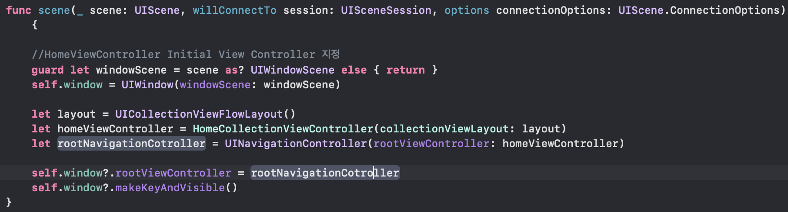

       * CollectionView의 경우 Flow Layout이 있어야 생성 할 수 있다.

## 2. SnpaKit을 적용하기 위해 Swift Package Manager 설치

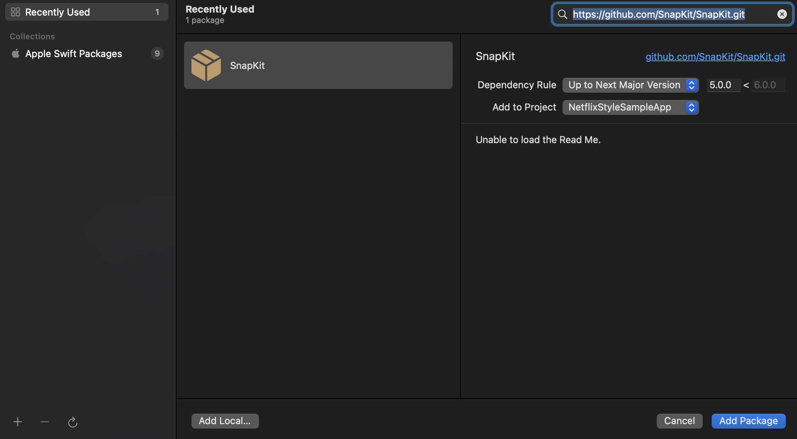     

## 3. Navigation Var Custom
  * HomeViewController.viewDidLoad()

    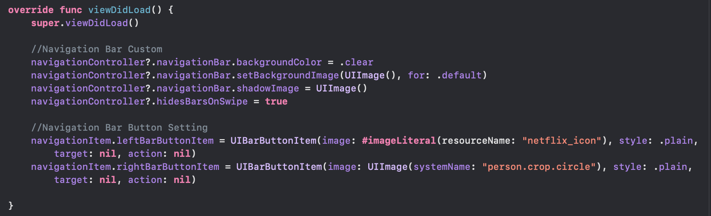

    * hidesBarOnSwipe: 스크롤로 인한 Swipe Action이 발생했을 경우 Navigation Bar를 가리는 효과

## 4. CollectionView에 표현할 Data 형태에 맞는 구조체 생성
  * Contnet.plist 추가

    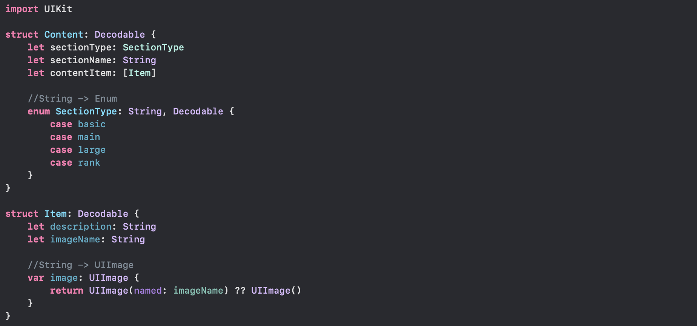

    * PropertyList에 대한 Decoding이 필요하므로 Decodable Property 채택
      * 읽기작업만 필요하므로 Codable 전채를 채택할 필요가 없다.
    * sectionType의 경우 main, basic, rank등 String Tyep이지만 몇가지 케이스를 둔 타입형태 이므로 String으로 주어지더라고 해당 String을 Enum으로 바꾸는것이 조금 더 직관적이고 편리하다. 

## 5. Content 배열이 Content.plist에 있는 Data를 가져올 수 있도록 기능 구현

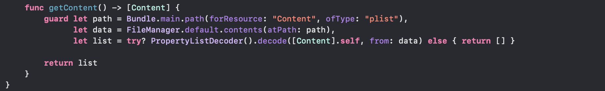

* viewDidLoad() -> contents = getContent

## 6. UICollectionView DataSource Setting

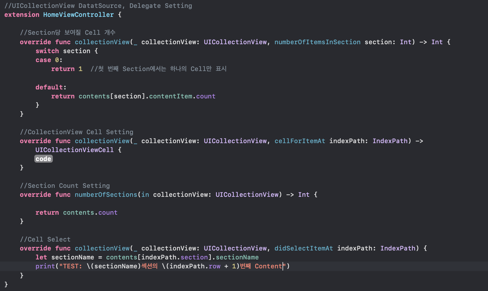

## 7. 포스터 이미지만 표현되는 List에서 기본 Cell 생성
  * Content 구조체에서 basic 역할
   
    

    * UICollectionViewCell의 경우 self를 사용해서는 화면에 적용되지 않는다.
    * UICollectionViewCell 의 Layout을 표현하는 것은 기본 Cell이 있고 contentView라는 기본 객체가 존재한다. 
    * 개발자는 contentView를 SuperView로 보고 contentView에 SubView를 올려서 작업해야한다. 

## 8. 생성한 Cell을 CollectionView에 등록
* HomeViewController -> viewDidLoad()
   
    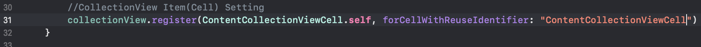

* HomeViewController -> extension

    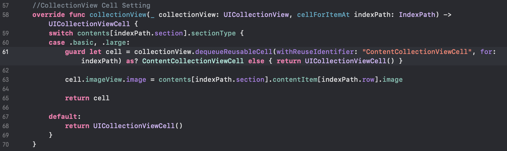

## 9. Header 생성

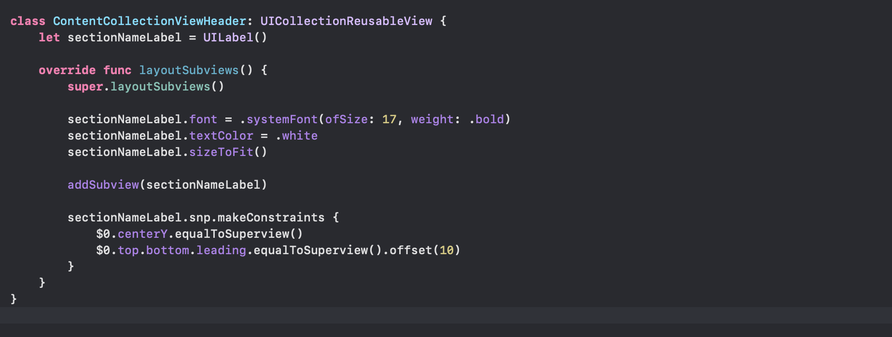

## 10. 생성한 Header를 CollectionView에 등록

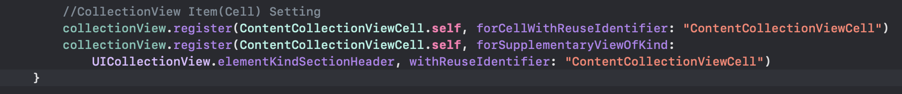

* Haeder는 Cell이 아니므로 forSupplementaryViewOfKind로 CollectionView에 알려주어야 한다.

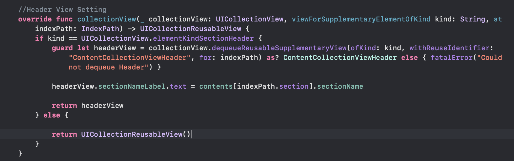