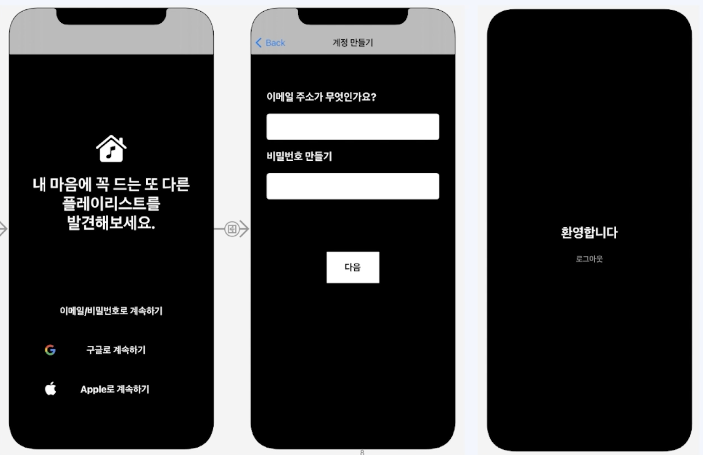
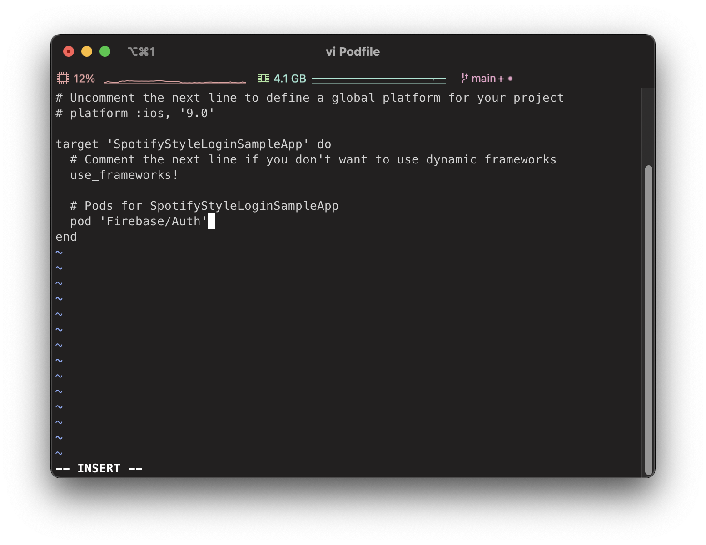

# Spotify 스타일 로그인 화면 구현하기

## UI 구성

1. Storyboard 에서 Navigation View Controller 생성
   * Initial View Controller 지정
2. View Controller 생성
   * Navigation View Controller의 Root View Controller로 지정
   * class LoginViewController: UIViewController 생성
   * Class: LoginViewController, Storyboard ID: LoginViewController
   * Background Color: Black
3. LoginViewController의 Navigation Bar 삭제 기능 구현
   * LoginViewController.viewWillApepear 설정 
4. Image View, Label 생성후 Vertical Stack View 설정
   * Image
     * Image: music.house.fill
     * Tint: White Color
     * Width: 70, Height: 80 
   * Label
     * text: 내 마음에 꼭 드는 또 다른\n플레이리스트를\n발견해보세요.
     * Color: White Color
     * Font StyleL Bold, Font Size: 31
     * Alignmet: Center
     * Lines: 3
   * Stack View
     * Alignment: Center
     * Distribution: Fill 
     * Spacing: 0
     * Auto Layout
       * Cneter Horizontally in Safe Area
       * Center Vertically in Sage Area
       * Center Y Multiplier: 4/5 
5. Button 3개 생성후 Vertical Stack View 설정
   * Button 
     * Font Style: Bole
     * Font Size: 18
     * Font Color: White Color
     * Auto Layout Height: 60 
     * 각 버튼의 Leading, Trailing 제약조건 추가
   * Stack View
     * Alignment: Center
     * Distribution: Fill Equally
     * Spacing: 15
     * Auto layout
       * Cneter Horizontally in Safe Area
       * Leading: 30, Trailing: 30
       * 위쪽에 위치하는 Stack View 와 Vertical Spacing
       * Constant: 60 
   * 각 버튼의 Layer Border 설정
     * Outlet 변수 설정
     * LoginViewController.viewDidLoad()에 기능 구현
       * 세가지 버튼 모두 동일한 형태의 테두리 UI를 지정할 것 이므로 forEach 문을 이용해서 반목을 줄인다.
6. View Controller 생성
   * Class: EmailViewController
   * Storyboard ID: EmailViewController
   * LoginViewController.emailLoginButton의 Action Segue: show
   * Navigation Bar title: 이메일/비밀번호 입력하기
   * Background Color: Black
   * EmailViewController의 Navigation Bar 표시 기능 구현
7. EmailViewController에 Lable 2개, TextField 2개 생성후 Vertical Stack View 설정 
   * emailTextField.Keyboard Type: E-mail Arrdess
   * emailTextField.Height: 50
   * passwordField.Secure Text Entry 설정
   * passwordFiedl.Height: 50
   * Stack View
     * Alignment: Fill
     * Distribution: Equal Spacing
     * Spacing: 20
     * Auto Layout
       * Cneter Horizontally in Safe Area
       * Leading: 30, Trailing: 30
       * Top Space to Safe Area.Constnat: 70 
8. Error Message를 위한 Label을 Vertical Stack View에 추가
   * Font Color: Red
   * Lines: 0  
9. Button 추가
   * Width: 100, Height: 60  
   * Cneter Horizontally in Safe Area 
   * 버튼 Layer Border 설정
     * EmailViewController.viewDidLoad()에 기능 구현
   * 버튼 비활성화 기능 구현
10. MainViewController 생성 
   * Navigation Bar 삭제 기능 구현
   * Pop Gesture 삭제 기능 구현
   * tapLogoutButton에 popRootViewController 기능 구현       

---

## 이메일/비밀번호 로그인, 로그아웃 기능 구현
1. Firebase Authentication에 전달할 emailTextField와 passwordTextField에 입력된 Text 값을 받아오기 위한 TextFiledDelegate 설정
   * textFieldShouldReturn(): email, password 입력이 끝난 후 Return Button 이 눌렸을 때 Keyboard가 내려가는 기능 구현
   * textFiledDidEndEditing: emailTextField, passwordTextField에 값이 채워졌을 때 nextButton 활성화 기능 구현
     * 두 Text Field에 모두 Text 값이 있을 때 활성화 조건
2. EmailViewController에 처음 들어왔을 때 커서가 emailTextFiled에 위치하도록 기능 구현
3. Firebase 이메일/비밀번호 인증 기능 구현
   * Firebas.Auth SDK에서 제공하는 createUser를 통해서 Firebase 인증 플랫폼에 데이터 전달
   * closer 내에서는 결과값을 받게 된다.
   * 계정 생성이 정상적으로 됐다면 MainViewController로 화면을 이동(3-1)
   * 로그인한 이메일이 MainViewController에 들어섰을 때 표현될 기능 구현(3-2)
   * 동일한 계정이 계속 가입되는 것을 방지하는 기능 구현(3-3)
     * 같은 이메일로 다시 신규 사용자 생성 코드를 타게되면 17007 error 객체 발생
     * Firebase Auth를 통한 로그인을 할 수 있는 SignIn Closer 추가
   * 로그아웃 기능 구현(3-4)
     * tapLogoutButton Action 함수에 SignOut 함수 추가
       * 해당 함수는 Error 처리를 위한 throw 함수 이므로 do-tryCatch문을 사용하여 처리한다. 

---

## Google 로그인, 로그아웃 기능 구현

---

## OAuth
* 사용자 인증 방식에 대한 업계 표준
* ID/PW를 노출하지 않고 OAuth를 사용하는 업체의 API 접근 권한을 위임 받음
* 순서
  1. User가 App에 로그인 요청
  2. App의 Server가 Service Provier에게 권한 위임 요청을 보냄(Request Token)
  3. Service Provier에서 User에게 권한 위임 확인 요청
  4. User가 Service Provier에게 권한 위임 승인
  5. Service Provier가 App에 Access Token 전달 (App Server에서 관리)
  6. 로그인 완료

---

## firebase 연결하기
* iOS 연걸
  * Apple 번들 ID 등록
    * XCode Project -> TARGETS -> Bundle Identifier
  * GoogleService-Info.plist 다운 및 xCode 등록
  * Cocoapods를 이용한 Firebase SDK 추가 
   
   
  
  * Firebase 초기화 선언
    * AppDelegate -> import Friebase
    * AppDelegate -> application.FirebaseApp.configure()

