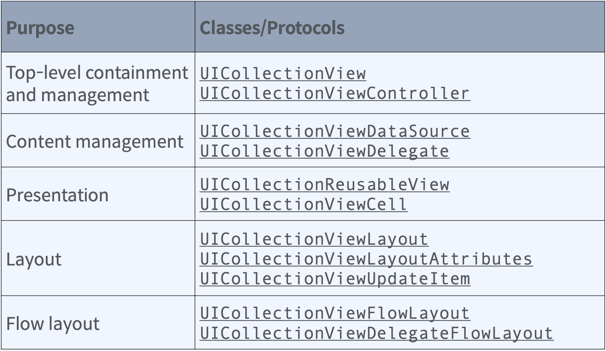
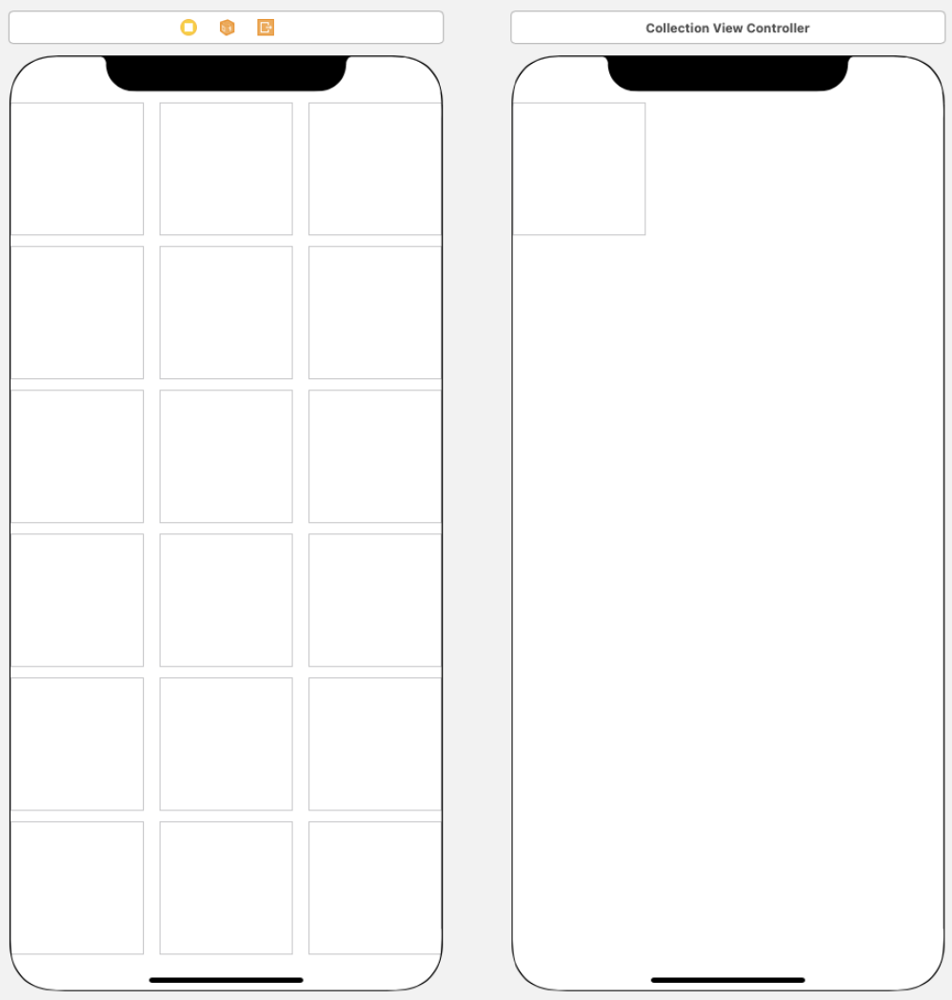
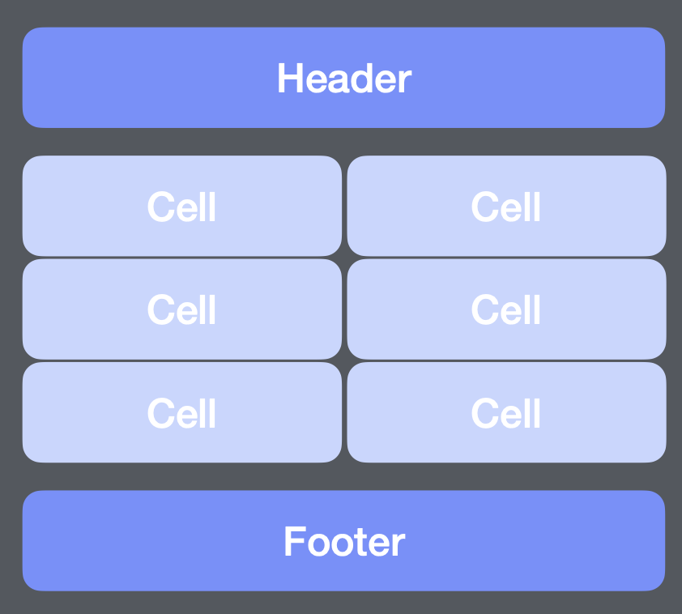
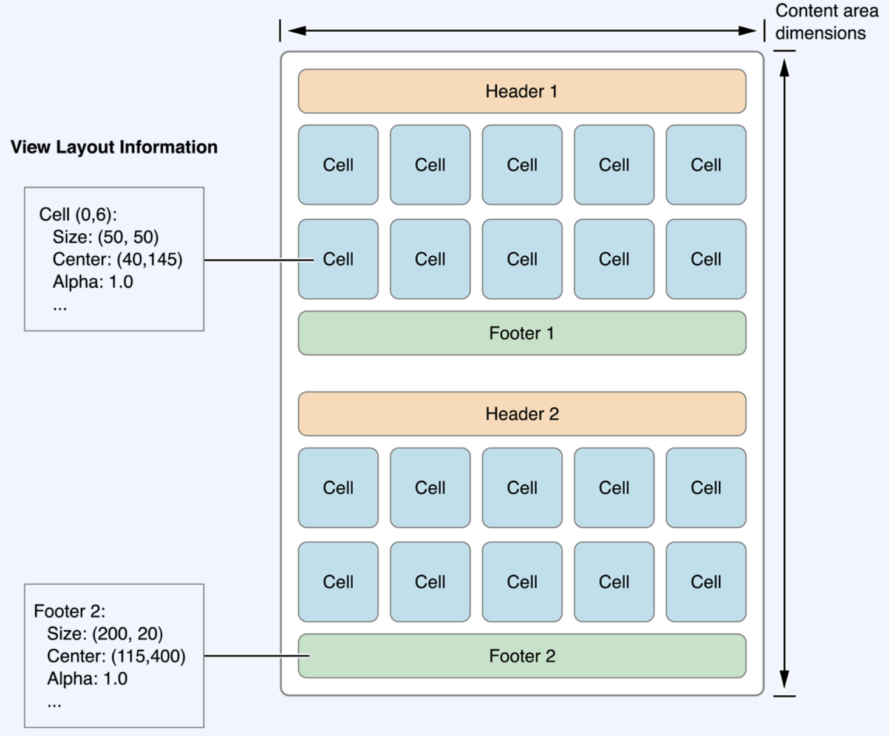
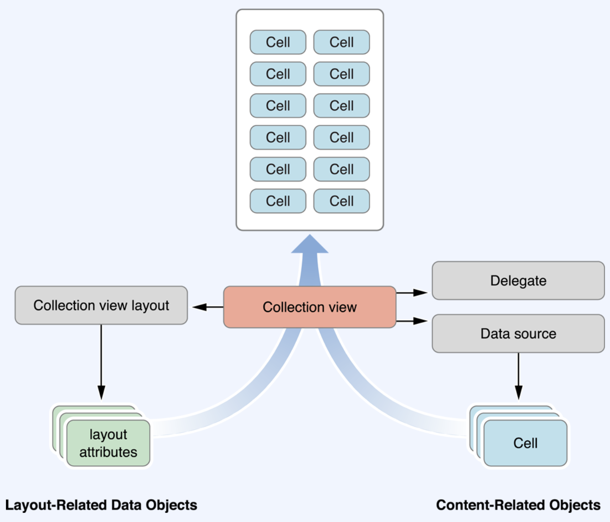

# UICollectionView

## 정의   
`유연하게 변경 가능한 Layout을 사용하여 특정 타입 형태로 정렬된 데이터 집합을 표시하는 방법`   
> UICollectionView의 가장 일반적인 용도는 항목을 격자와 같은 배열로 표시하는 것이지만,   
> iOS의 UICollectionView는 행과 열의 나열 뿐만 아니라 다양한 배열 구현을 가능하게 한다.   

> UICollectionView는 Data와 해당 Data를 표시하는 시각적 요소를 엄격하게 구분한다.   
> 즉, 데이터를 어떻게 관리할지 또 그러한 데이터를 어떻게 나타낼지 모두 별도로 고려해서 개발해야 한다.   
> 동시에 사용자에게 어떠한 화면을 보여줄 것인가에 대한 View를 가져와서 화면에 배치하는 모든 작업 또한 개발되어야 한다.   

> View를 어떻게 배치할지, 각각의 View는 어떤 속성을 갖는지 지정할 수 있는 `Layout`객체와 할께 View 작업을 수행한다.   

`따라서 Data 영역, Layout영역은 각각 분리가 되어서 각자의 역할에 맞는 정보를 제공하고 UICollectionView는 이러한 두 구분을 종합하여 최종 형태를 구축하게 된다.`   

---
 
## UICollectionView를 구현하기 위한 Class와 Protocol    

> 위의 이미지는 UIKit에서 제공하는 UICollectionView 관련 Class와 Protocol을 각각의 역할에 따라 정리한 표이다.   
> 대부분의 클래스는 하위 클래스화 할 필요 없이 있는 그대로 사용하도록 설계되었기 때문에 상대적으로 아주 적은 코드로 복잡한 UI를 구현할 수 있다.   

### Top-level Containment and Management

최상위 레벨에서 관리 역학을 하는 `UICollectionView`와 `UICollectionViewController` 가 존재한다.   
* UIColletionView Class
  * UICollectionView 클래스 객체는 `CollectionView가 갖는 Contents의 시각정인 요소를 정의`한다.  
  * `UIScrollView를 상속`받기 때문에 이후에 다른 Layout객체에서 수신하는 `Layout정보 기반으로 데이터를 쉽게 표시`할 수 있도록 도와준다.    
* UICollectionViewController Protocol
  * CollectionView를 ViewController 수준에서 관리할 수 있게 도와준다.   
    > UITableView와 UITableViewController와 같은 관계라 생각하면 된다.    

### Content Management
* `UICollectionViewDataSource` Protocol
  * DataSource는 UICollectionView와 연결된 가장 중요한 객체로서 `반드시 제공`해야하는 객쳋이다.
  * DataSource는 ContentView의 Content를 관리하고 해당 Content를 표시하는데 필요한 View를 만들다.
  * 이러한 DataSource를 구현하려면 CollectionViewDataSource Protocol을 준수하는 객체를 만들어야 한다.   

* `UICollectionViewDelegate` Protocol
  * UICollectionViewDelegate를 사용하면 `CollectionView에서 발생하는 특정 Action이나 상황을 캐치해서 View의 동작을 사용자 지정화` 할 수 있다.
  * Delegate는 DataSoucre와 달리 선택사항이다.

### Presentation

* `UICollectionViewReuseableView`
  * UICollectionView에 표시되는 모든 View는 UICollectionReuseableView의 인스턴스 이어야 한다.   
    > 이 클래스는 ColletionView에서 사용중인 재사용(재활용) 매커니즘을 지원한다.   
    > 매번 새 View를 계속해서 만드는 대신에 이 View를 재사용해서 일반적으로 성늘이 향상되고 특히 스크롤하는 동안에 사용자가 느껴지는 성능적인 요소들이 향샹된다.    

* `UICollectionViewCell`
  * UICollectionViewCell 객체는 Data항목에 사용하는 재사용 가능한 View로 특정 유형의 배열을 갖게된다.   

### Layout
* `UICollectionViewLayout`
* `UICollectionViewLayoutAttributes`
* `UICollectionViewUpdateItem`
* Layout은 UICollectionView만 갖고있는 속성으로서, UICollectionViewLayout과 그 하위 Class들을 Layout 객체라 묶어서 말하며, UICollectionView 내에서 Cell과 ReuseableView의 위치, 크기, 시각적 속성 등을 정의하는 역할을 한다.   
* 이러한  책임 분리를 통해서 App에서 관리하는 Data 객체를 변경하지 않고도 Layout을 동적으로 변경할 수 있다.   
    > Layout이라는 말을 보고 부모 View가 자식 View를 재배치하는데 사용하는 LayoutSubView 메서드를 떠올릴 수 있지만, UICollectionView에서 말하는 Layout은 Layout 메서드에서 구현하는 상황과는 전혀 다르다.   
    UICollectionViewLayout 객체는 Layout대상이 되는 View를 실제로 소유하지 않고 Layout 프로세스동안 UICollectionViewLayout 객체는 UICollectionViewCell과 ReuseableView 등의 위치, 크기, 시각적 모양 등을 설명하는 속성을 알려주는 Layout속성 객체를 만든다.   
    그런 다음 UICollectionView가 이러한 속성을 실제 View 객체에 적용하게 된다.   
* Layout객체는 UICollectionView 내에서 Data 항목이 삽입, 삭제, 이동 할 때 마다 UICollectionViewUpdateItem 클래스의 인스턴스를 받는다
    > 이 클래스의 인스턴스는 개발자가 직접 구현할 필요는 없다.

### Flow Layout
* `UICollectionViewFlowLayout`
* `UICollectionViewDelegateFlowLayout` Protocol
* UICollectionViewFlowLayout 클래스는 Grid나 기타 선 기반 Layout을 구현하는데 사용되는 구체적인 Layout객체이다.   
* 클래스를 있는 그대로 또는 UICollectionViewDelegateFlowLayout과 함꼐 사용하기 때문에 Layout 정보를 동적으로 사용자화 할 수 있다.

---

## Layout metric을 나타내는 Layout 객체

> 세로 스크롤의 FlowLayout이 Header, Cell, Footer의 Supplementary View를 정렬하는 방법을 설명하고 있다.

> 세로 스크롤 FlowLayout에서는 컨텐츠 영영의 넓이가 고정된 상태로 유지되고 높이가 컨텐츠를 수용할 수 있도록 유독정으로 커진다.   
> 이러한 면적을 계산하기 위해 Layout객체는 View와 Cell을 한번에 하나씩 배치하고 각각의 가장 적합한 위치를 선택한다.   
> FlowLayout의 경우 Layout객체 또는 Delegate를 사용해서 Cell과 Supplementary View의 크기가 attrivute(속성)으로 지정되게 된다.   
> FlowLayout은 이런 속성을 상용해서 각 View를 배치할 수 있게 계산한다.   

---

## 5가지 요소를 합쳐서 CollectionView가 표시된 모습

1. UICollectionView는 DataSource에서 표시할 Cell에 대한 정보를 가져온다.
2. DataSource와 Delegate 객체는 사용자 지정 객체 Cell을 선택, 강조 같은 표시를 포함해서 컨텐츠를 관리하는데 사용된다.
3. Layout객체들은 해당 Cell이 속하는 위치를 결정하고 해당 정보를 하나 이상의 Layout속성 객체 형태로 CollectionView에 보내는 역학을 한다.
4. CollectionView는 Layout정보를 실제 Cell에 포함한 다음 ReuseableView들과 병합하여 최종적으로 보여지는 프레임을 만들게 된다.

