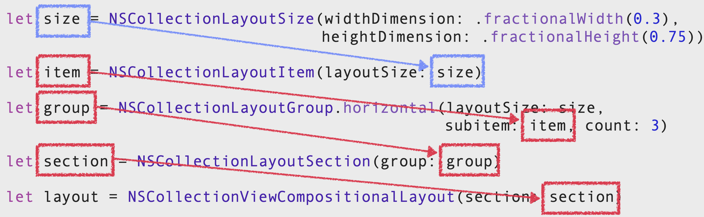
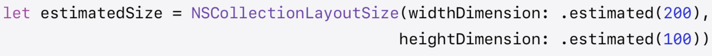

# UICollectionViewCompositionalLayout

## 개요   
다양한 Layout이 중첩된 형태로 나타나는 UI화면을 어떻게 구현해야할까???
Apple에서도 UICollectionView는 FlowLayout만 이용해서 Layout을 설정하도록 권장하고 있다.   
Layout을 커스텀하면 다이나믹하고 다양한 Layout을 만들 수 있지만, 코드가 아주 길어질 수 밖에 없으며, 코드가 길어진다는 것은 버그 발생률이 높아지고 가독성이 떨어져 유지보수에 어려음을 초례한다.   
이러한 어려움을 개선하고 좀더 직관적이고 간편한 Layout 구현을 위해서 iOS13+ 부터 `UICollectionViewCompositionalLayout`을 제공한다.   

## 정의
UICollectionViewCompositionalLayout을 직역하면 구성 가능한 Layout으로서 복작한 UI를 그리는 것이 목표더라고 각각의 구성요소 자체는 단순해서 이런 단순한 구성요소를 각각으로 여러가지 방식으로 구성해 복작한 UI를 구현한다.

## 장점   
* 유연하게 변경과 응용이 가능하새 기존 Flow Layout을 이용한 Layout은 물론 커스텀으로 가능했던 더 복잡한 Layout도 작성할 수 있다.   
* 퍼포먼스를 프레임워크 단위에서 알아서 수행하여 개발자는 성능에 대한 고민을 덜 하고도 Layout 목적에만 집중할 수 있다.   

## CompositionalLayout을 구현 코드

> CompositionalLayout을 구현하려면 세가지의 main 구성요소가 필요하다.   

> 이 세가지 구성요소는 사다리처럼 Layout size를 통해서 커스텀하게 size를 지정하고, 이렇게 만들어진 size객체는 item, group의 초기화 객체로 들어가게 된다.

> 마지막으로 section이 CompositionalLayout 생성에 들어간다.

### item

 
* CollectionView에서 개별 Content의 크기, 공간, 정렬 방법에 대한 청사진 역할
* 화면에 랜더링 되는 단일 View를 나타낸다. 
* 일반적으로 Item은 Cell이지만 항목은 Header나 Footer, DecorationView와 같은 Supplementary View를 포함해서 말한다.
* 각 Item은 넓이와 높이 디멘션을 갖는 고유한 사이즈를 지정한다.
* Item은 상대적인 치수를 절대값으로 표현하거나 시스템 글꼴 크기 변경에 대한 응답으로 RunTime시에 변경될 수 있는 추정값 같은 여러가지 방식으로 값을 표현할 수 있다.

## size
* item을 초기화할 떄 size를 넣어준다.
* size는 넓이와 높이 값을 갖게 되며 이러한 넓이와 높이 값을 치수(디멘션)이라 말한다.
* 디멘션을 세가지 타입으로 설정할 수 있다.
### Absolute

* 절대적인 값으로 Point값을 넣어서 정확한 치수를 지정할 수 있다.

### Estimate

* 추정 값을 의미하며, 데이터가 로드되거나 시스템 글꼴 크기가 변경되는 것과 같이 RunTime에 컨텐츠 크기가 변경될 수 있을 경우에는 Estimate를 사용한다.
* 초기 추정 크기를 제공하면 시스템이 나중에 실제 값을 계산해서 반영한다.
* Absolute와 같이 예상되는 Point값을 넣어주면 된다.

### Fractional

   

> 코드의 이미는 컨테이너 넓이의 20%와 동일한 넓이와 높이를 갖는 정사각형 Item

* 분수, 비율이라는 의미로 분수값을 사용해서 아이템 컨테이너를 기준으로 값을 정의한다.
* 만약 컨테이너의 크기가 변경되면 절대값은 그에 따라서 커지고 축소된다

### group

 

* item들이 서로 관련하여 배치되는 방식을 결정해서 결합하는 역할을한다.
* group는 항목을 가로행, 세로열 또는 사용자 지정 배열로 배치할 수 있다.
* 각 group는 자신의 사이즈를 지정할 떄 절대값으로 또는 시스템 글꼴 크기의 변경에 따라 변경횔 수 있는 추정 값으로 또는 컨테이너의 상대적인 치수를 대비하는 유연한 방식으로 표현할 수 있다. 
    > 이러한 이유는 group는 CollectionLayoutItem의 하위 클래스 이기 떄문이다.   
    > 따라서 item처럼 작송할 수 있다
* 즉, group는 item만 포함하는 것이 아니라 다른 group을 포함할 수 있다.(Nested Group)   
    > Stack View와 유사

    

* 결국 다른 항목 및 group와 결합하여 좀더 복잡한 Layout으로 만들 수 있다.

### section

 

* group으로 이루어져 있으며 CollectionView Layout에는 하나 이상의 section이 존재한다.
* section은 각각의 Layout을 각각의 영역으로 분리하는 방법을 제공한다.
* 각 section은 CollectionView의 다른 section과 Layout이 같거나 다를 수 있다.
* 이러한 section의 Layout은 section을 만드는데 사용되는 group의 속성에 의해서 결정된다.
* 각 section은 다른 section과 구분하기 위해 고유한 Background나 Header, Footer들을 넣을 수 있다.

### Layout

   

* 위에서 언급한 모든 구성요소들을 반영한다
* section이 있어야 하고 section은 group이 있어야 하며, group은 item이 필요하다.

---
* SnapKit 알아보기   
Auto Layout을 코드로?   
Auto Layout에는 고려해야할 다양한 Constrate가 존재한다.   
SnapKit은 Code 베이스로 UI를 구현하고 Auto Layout을 고려해야 할 때 아주 직관적이고 간편하게 작성할 수 있도록 도와주는 Open Source Framworke 

SnapKit과 같으 외부 라이브러리를 활용하기 위해서 기존에는 Cocoapods를 사용했지만, Swift Package Manager를 사용한다.    
Package를 사용하고자하는 프로젝트에 SnapKit에 대한 dependency 주소를 넣어주면된다.   

